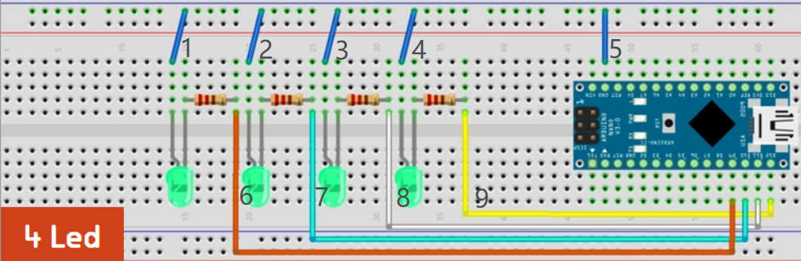

### Simple Demo Tutorial

#### Based Picture

#### Note For Severity

- high -- block till review is made
- middle -- not block and show the result immediately
- low -- not block and show the result  till the circuit is built

#### Tutorial 

The following is the tutorial of one of the recommended sequence.

**STEP0. add arduino**

- no behavior

**STEP 1. add 4 resistors from left to right**

Behavior: Measure the resistance before insertion

- Hint for operator: Please measure the resistance before inserting resistors.
- Hint for reviewer: Please judge whether resistors were measured.
- Severity: middle

**STEP 2. add 4 led from left to right**

Behavior:  Make sure the LEDs' polarity is correct before insertion

- Hint for operator: Please make sure the LEDs' polarity is correct before insertion.
- Hint for reviewer: Please judge whether the LEDs' polarity is correct.
- Severity: high

**STEP3. add wire 6-9**

Behavior:  Try to avoid crossing wires and go for 90° wire bends

- Hint for operator: Please avoid crossing wires and go for 90° wire bends.
- Hint for reviewer: Please judge whether the layout of wires is reasonable.
- Severity: low

**STEP4. add wire 1-4**

Behavior:  Make sure the usage of the power line is true.

- Hint for operator: please make sure the usage of the power line is true.
- Hint for reviewer: Please judge whether the usage of the power line is true.
- Severity: middle

**STEP5. add wire 5**

- no behavior

#### Sequence

Make sure that "add wire 5" is the last step.

It is recommended that progress from left to right.